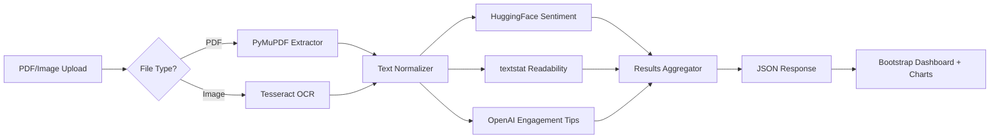
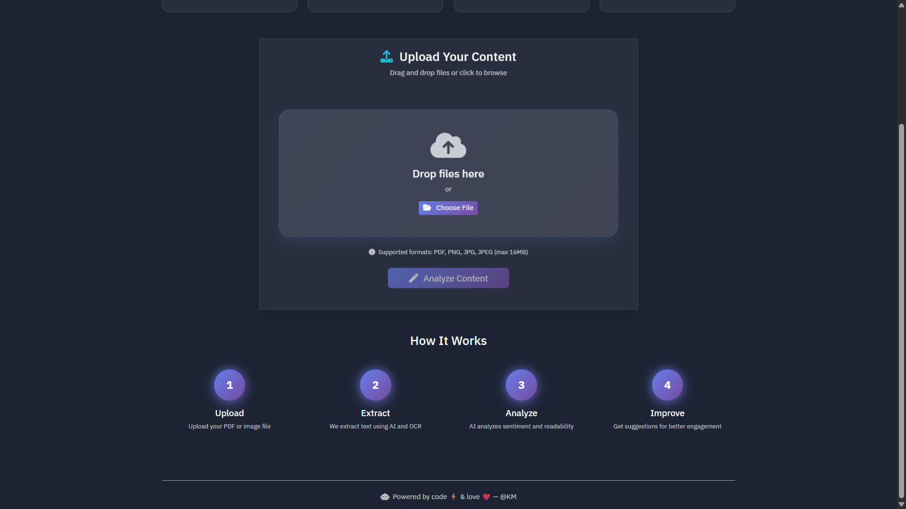
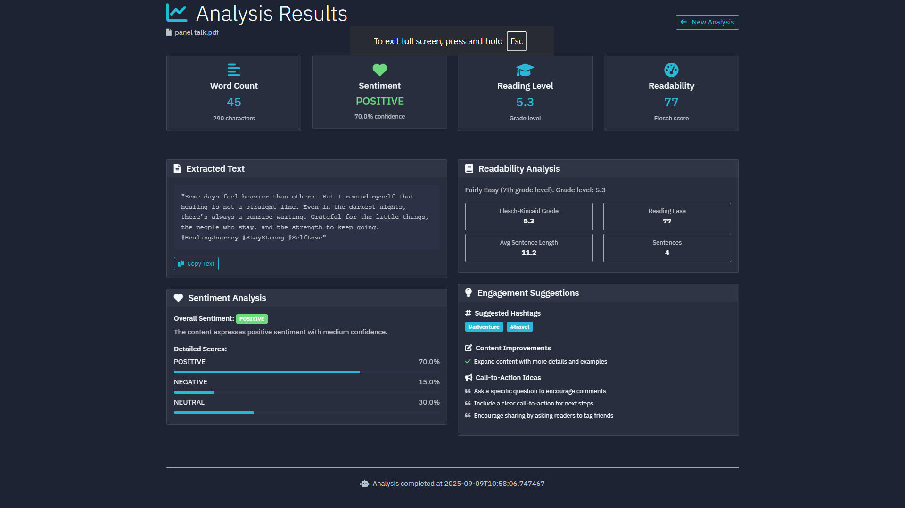

# 🚀 Social Media Content Analyzer

*A Flask-based web app that extracts text from PDFs & images, runs AI-powered sentiment + readability analysis, and suggests engaging social copy.*

<p align="center">
  
</p>

<p align="center">
  <a href="https://img.shields.io/badge/Python-3.8%2B-blue"> </a>
  <a href="https://img.shields.io/badge/Flask-2.x-000"> </a>
  <a href="https://img.shields.io/badge/License-MIT-success"> </a>
  <a href="https://img.shields.io/badge/Transformers-HF-orange"> </a>
  <a href="https://img.shields.io/badge/Textstat-Readability-9cf"> </a>
  <a href="https://img.shields.io/badge/OpenAI-Engagement%20Tips-4B9"> </a>
</p>


<p align="center">
  
</p>

---

## ✨ Features

### 📁 File Processing

* **PDF Text Extraction** via **PyMuPDF**
* **OCR for Images** (PNG/JPG/JPEG) using **Tesseract** + **Pillow**
* **Drag & Drop Upload** with progress feedback
* **Strict Validation** for file types, sizes, and content

### 🤖 AI-Powered Analysis

* **Sentiment Analysis** using **Hugging Face Transformers**
* **Readability Scores** via **textstat** (Flesch, SMOG, Gunning Fog, etc.)
* **Engagement Suggestions** via **OpenAI** (GPT‑5 or compatible)
* **Real-time Status** with streaming UI updates

### 🎨 Modern Web Interface

* **Responsive, Dark Theme** (Bootstrap 5)
* **Interactive Dashboard** with clean semantic sections
* **Results Visualization** (Chart.js-ready)
* **Graceful Error Handling** and actionable messages

---


## 🏗 Architecture



---

## ⚡ Quick Start

```bash
# Clone
git clone https://github.com/your-username/social-media-content-analyzer.git
cd social-media-content-analyzer

# Create & activate venv
python -m venv .venv
# Windows
.venv\\Scripts\\activate
# macOS/Linux
source .venv/bin/activate

# Install
pip install -r requirements.txt
```

> **Tesseract OCR** is required. See [Installation](#-installation) for OS-specific commands.

---

## 🛠 Installation

### Prerequisites

* Python **3.8+**
* **Tesseract OCR** installed on system
* **OpenAI API key** (optional, for engagement suggestions)


## 🔐 Environment Variables

Create a `.env` file in the project root:

```bash
SESSION_SECRET=your-session-secret-key
OPENAI_API_KEY=your-openai-api-key  # Optional
# Optional: Model choices / timeouts
# OPENAI_MODEL=gpt-5
# HF_MODEL=cardiffnlp/twitter-roberta-base-sentiment
# MAX_UPLOAD_MB=25
```

> **No OpenAI key?** The app still runs sentiment + readability; engagement tips will be disabled gracefully.

---

## ▶️ Running the App

```bash
# Development
flask --app app run --debug

# or
python app.py
```

Then open **[http://localhost:5000](http://localhost:5000)**.

---


## 🗂 Folder Structure

```
social-media-content-analyzer/
├─ app.py
├─ requirements.txt
├─ .env.example
├─ static/
│  ├─ css/
│  ├─ js/
│  └─ assets/
│     └─ demo.gif              
├─ templates/
│  └─ index.html
├─ services/
│  ├─ pdf_extractor.py
│  ├─ ocr_extractor.py
│  ├─ sentiment.py
│  ├─ readability.py
│  └─ engagement.py
└─ tests/
```

---

## 🔌 API Endpoints

* `POST /analyze` — Upload file(s) and run analysis

  * **Form fields**: `file` (PDF/PNG/JPG/JPEG)
  * **Response** (JSON):

    ```json
    {
      "sentiment": {"label": "POSITIVE", "score": 0.97},
      "readability": {"flesch": 63.4, "smog": 7.2, "gunning_fog": 9.1},
      "engagement": {
        "headline": "…",
        "caption": "…",
        "hashtags": ["#ai", "#marketing"],
        "cta": "…"
      },
      "meta": {"chars": 1240, "words": 216}
    }
    ```

---

## 🖼 Screens & Animations

Add rich visuals to your README by committing assets to `static/assets/` and referencing them here.

| View                                        | Description                                    |
| ------------------------------------------- | ---------------------------------------------- |
|          | Drag & drop with live validation               |
|        | Sentiment + readability, with copy suggestions |

**How to capture an animated GIF:**

* Windows: \[ScreenToGif]
* macOS: \[Kap]
* Linux: \[peek]


## 🔒 Security & Privacy

* Files are processed **in-memory** where possible; avoid writing to disk.
* Strip EXIF metadata from images before storage.
* Do **not** log raw text by default; log only metrics.
* Rate-limit uploads; validate MIME, extension, and size.
* If deploying, set HTTPS and strong `SESSION_SECRET`.

---

## ⚙️ Performance Tips

* Reuse **HF pipelines** and cache models on startup.
* Downscale very large images before OCR.
* Chunk long texts and **batch** requests to OpenAI.
* Use a **worker queue** (Celery/RQ) for heavy jobs.

---

## 🧰 Troubleshooting

* **Tesseract not found**: Ensure it’s installed and on `PATH`.
* **OpenAI errors**: Missing/invalid key → tips disabled; check quotas.
* **PDF extract empty**: Confirm the PDF contains selectable text (not just scans) or fall back to OCR.

---

## 🗺 Roadmap

* [ ] Multi-file batch analysis
* [ ] Chart.js visualizations of sentiment over time
* [ ] Multi-language OCR and sentiment models
* [ ] Export results (CSV/JSON/Markdown)
* [ ] OAuth login for saved projects

---

## 🤝 Contributing

PRs welcome! Please:

1. Open an issue describing your change.
2. Follow code style (`black`, `ruff`).
3. Add tests where relevant.

---

---

### 🙌 Acknowledgements

* \[Flask] · \[PyMuPDF] · \[pytesseract] · \[Pillow] · \[transformers] · \[textstat] · \[OpenAI]

> *“The best copy is clear, kind, and concise.”* Now let’s ship 🚀
